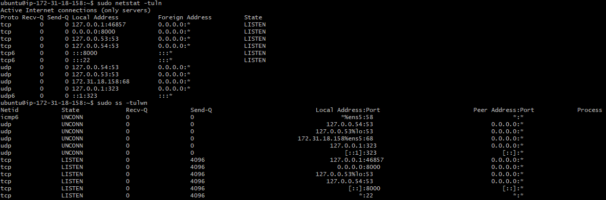

#  **CloudOps Ltd. System Administrator Tools Assignment**

## **Part 1: User & Group Permissions**

### **Task 1.1 — Create Users & Group**

**Commands:**

```bash
sudo groupadd network_team
sudo useradd -m -G network_team alice
sudo useradd -m -G network_team bob
```


**Explanation:**
We create a group `network_team`, then add users `alice` and `bob` with home directories and assign them to the group.

---

### **Task 1.2 — Set Directory Permissions**

**Commands:**

```bash
sudo mkdir /opt/network_data
sudo chown root:network_team /opt/network_data
sudo chmod 770 /opt/network_data
ls -ld /opt/network_data
```


**Explanation:**
We create a shared directory for the team with full access to the group and no access to others.

---

## **Part 2: Network Tools & Diagnostics**

### **Task 2.1 — Connectivity Checks**

**Commands:**

```bash
ping -c 4 google.com
traceroute google.com
mtr --report google.com
```


**Explanation:**
Ping checks basic connectivity; traceroute and mtr diagnose the route and latency to `google.com`.

---

### **Task 2.2 — Open Ports & Services**

**Commands:**

```bash
sudo netstat -tuln
sudo ss -tulwn
```



**Explanation:**
Displays listening services and open TCP/UDP ports on the system.

---

### **Task 2.3 — Remote Port Connectivity**

**Commands:**

```bash
telnet google.com 443
nc -zv google.com 443
```


**Explanation:**
Tests whether `google.com` is accepting connections on port 443 (HTTPS).

---

### **Task 2.4 — Network Interfaces**

**Commands:**

```bash
ifconfig
ip addr
```


**Explanation:**
Lists network interfaces and IP addresses assigned to the system.

---

### **Task 2.5 — DNS Lookup**

**Commands:**

```bash
nslookup google.com
dig google.com
```


**Explanation:**
Tests DNS resolution to convert domain names to IP addresses.

---

### **Task 2.6 — Download a Test File**

**Commands:**

```bash
wget https://example.com/testfile.txt
curl -O https://example.com/testfile.txt
```

**Explanation:**
Demonstrates use of `wget` and `curl` for downloading files over HTTP.

---

### **Task 2.7 — Monitor Bandwidth**

**Commands:**

```bash
sudo iftop -i eth0
sudo nload eth0
```


**Explanation:**
Displays real-time network bandwidth usage for interface `eth0`.

---

##  **Part 3: Compression & Archiving**

### **Task 3.1 — Archive Directory**

**Command:**

```bash
tar cvf network_data.tar /opt/network_data
```

**Explanation:**
Creates a `.tar` archive of the `network_data` directory.

---

### **Task 3.2 — Compress with gzip**

**Command:**

```bash
gzip network_data.tar
```

**Explanation:**
Compresses the tar archive into `network_data.tar.gz`.

---

### **Task 3.3 — Decompress gzip**

**Command:**

```bash
gunzip network_data.tar.gz
```

**Explanation:**
Uncompresses the gzip file back to `.tar`.

---

### **Task 3.4 — Use bzip2 Compression**

**Commands:**

```bash
bzip2 network_data.tar
bunzip2 network_data.tar.bz2
```

**Explanation:**
Compresses and decompresses using `bzip2`, which provides better compression than `gzip`.

---

### **File Size Output**

**Command:**

```bash
ls -lh
```

**Explanation:**
Shows sizes of compressed/uncompressed files.

---

## **Part 4: Text Processing with grep & awk**

### **Task 4.1 — Search for “error” in logs**

**Command:**

```bash
grep "error" /var/log/syslog
```

**Explanation:**
Finds lines in the system log that contain the word "error".

---

### **Task 4.2 — Count Errors**

**Command:**

```bash
grep -c "error" /var/log/syslog
```

**Explanation:**
Counts how many times "error" appears in `/var/log/syslog`.

---

### **Task 4.3 — Extract Timestamps and Messages**

**Command:**

```bash
grep "error" /var/log/syslog | awk '{print $1, $2, $3, $5}'
```

**Explanation:**
Extracts date, time, and the source of each error log line.

---

### **Task 4.4 — Summarize Unique Error Sources**

**Command:**

```bash
grep "error" /var/log/syslog | awk '{print $5}' | sort | uniq -c | sort -nr
```


**Explanation:**
Shows how many errors came from each system component, sorted by frequency.

---
