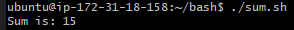
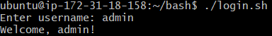
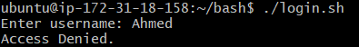

# Bash Scripting Assignment

## Task 1: Bash Function to Add Two Numbers

### Objective:

Create a shell script (`sum.sh`) that defines a function to add two numbers and returns the result.

### Script: `sum.sh`

```bash
#!/bin/bash

add() {
  local sum=$(( $1 + $2 ))
  echo "Sum is: $sum"
}

add 5 10
```

### Explanation:

* A function named `add` is defined, which accepts two arguments.
* It calculates the sum using arithmetic expansion `((...))`.
* `local` ensures the variable `sum` is only used inside the function.
* The function is called with `5` and `10` as arguments.

### Output:



---

## Task 2: Bash Script for User Login Check

### Objective:

Create a Bash script (`login.sh`) that prompts the user to enter a username and checks if it matches "admin".

### Script: `login.sh`

```bash
#!/bin/bash

read -p "Enter username: " user

if [ "$user" = "admin" ]; then
  echo "Welcome, admin!"
else
  echo "Access Denied."
fi
```

### Explanation:

* The script prompts the user to input a username using `read -p`.
* A simple `if` condition checks whether the input matches the string `admin`.
* Displays a welcome message if matched; otherwise shows an "Access Denied" message.

### Example Outputs:

**Case 1: Username is admin**



**Case 2: Username is not admin**




---