# Docker Tasks Assignment

## Practical Example 1: Basic Docker Commands

### Example 1

**Commands:**

```bash
# Step 1: Install Docker
sudo apt update
sudo apt install docker.io

# Step 2: Pull the hello-world image
sudo docker pull hello-world

# Step 3: List running containers
sudo docker ps

# Step 4: List all downloaded images
sudo docker images

# Step 5: Run the hello-world container
sudo docker run hello-world
```

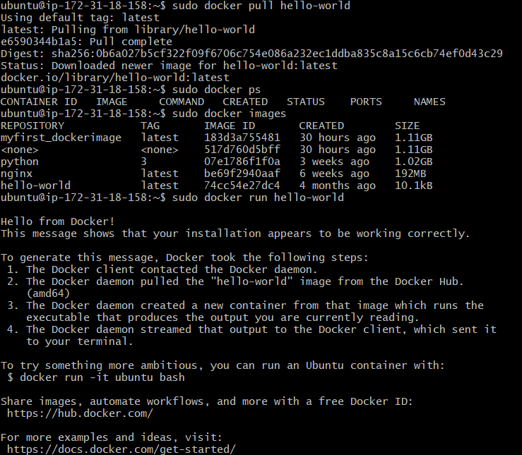

**Explanation:**

* `hello-world` verifies that Docker is installed and working properly.
* `docker ps` and `docker images` show running containers and stored images respectively.

---

### Example 2

**Commands:**

```bash
# Step 1: Pull the nginx image
sudo docker pull nginx

# Step 2: List running containers
sudo docker ps

# Step 3: List downloaded images
sudo docker images

# Step 4: Run nginx and map port 5000 on the host to port 80 in the container
sudo docker run -p 5000:80 nginx
```

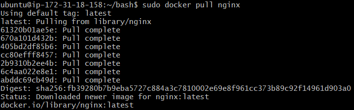
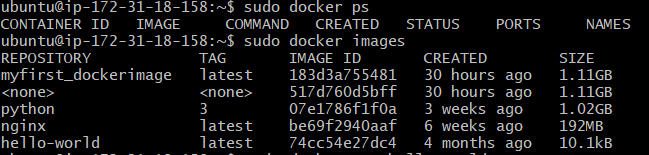
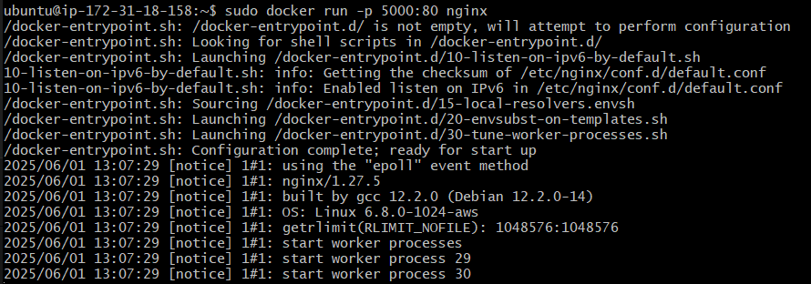

**Explanation:**

* Runs a web server using the official `nginx` image.
* `-p` flag maps host port 5000 to container port 80.

---

## Practical Example 2: Flask Application in Docker

### Step 1: Project Setup

```bash
mkdir app-python
cd app-python
```

**Files Created:**

#### `app.py`

```python
from flask import Flask
app = Flask(__name__)

@app.route('/')
def home():
    return "Hello from Flask in Docker!"

if __name__ == '__main__':
    app.run(host='0.0.0.0', port=8000)
```

#### `requirements.txt`

```
flask
```

#### `Dockerfile`

```Dockerfile
FROM python:3.11-slim
WORKDIR /app
COPY . .
RUN pip install --no-cache-dir -r requirements.txt
EXPOSE 8000
CMD ["python", "app.py"]
```


### Step 2: Docker Commands

```bash
# Build Docker image
sudo docker build -t python_app .

# List images
sudo docker images

# Run the Flask container
sudo docker run -p 8000:8000 python_app

# Check running containers
sudo docker ps
```

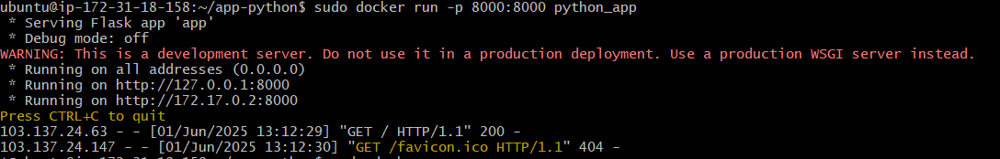
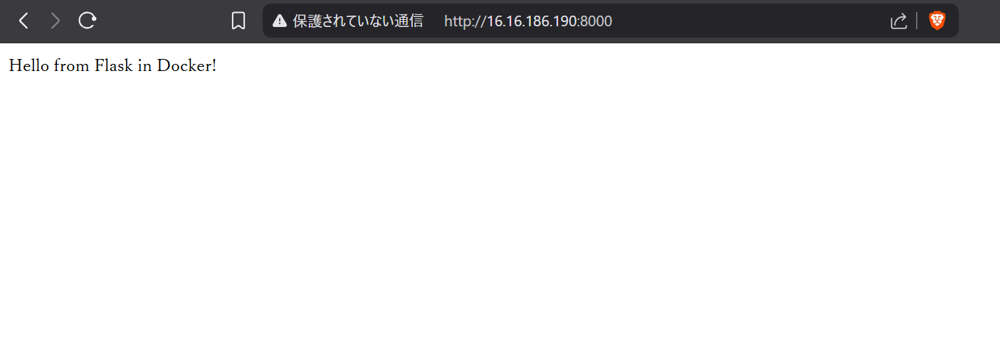

---

## Practical Example 3: Node.js Application in Docker

### Step 1: Project Setup

```bash
mkdir node-app
cd node-app
```

**Files Created:**

#### `index.js`

```javascript
const express = require('express');
const app = express();

app.get('/', (req, res) => {
    res.send('Hello from Node.js Express!');
});

app.listen(3000, () => {
    console.log('Node app listening on port 3000');
});
```

#### `package.json`

```json
{
  "name": "node-app",
  "version": "1.0.0",
  "main": "index.js",
  "scripts": {
    "start": "node index.js"
  },
  "dependencies": {
    "express": "^4.18.2"
  }
}
```

#### `Dockerfile`

```Dockerfile
FROM node:18-alpine
WORKDIR /app
COPY . .
RUN npm install
EXPOSE 3000
CMD ["node", "index.js"]
```

### Step 2: Docker Commands

```bash
# Build image
sudo docker build -t node_app .

# Check running containers
sudo docker ps

# List Docker images
sudo docker images

# Run the app
sudo docker run -p 3000:3000 node_app
```

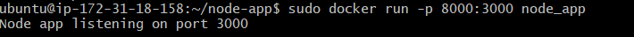
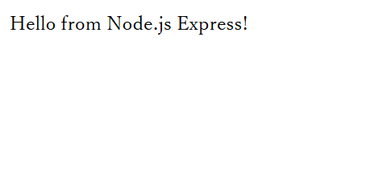

---

## Docker Compose

### Practical Example 1: Single Service Compose File

#### `docker-compose.yml`

```yaml
version: "3.8"
services:
  python-app:
    build: .
    container_name: myfirst_app
    ports:
      - "8000:8000"
```
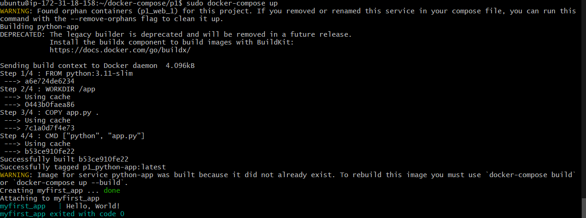

---

### Practical Example 2: Multi-Container Compose (Flask + Node)

#### `docker-compose.yml`

```yaml
version: '3.8'
services:
  python-app:
    build:
      context: ./app-python
    ports:
      - "8000:8000"

  node-app:
    build:
      context: ./node-app
    ports:
      - "3000:3000"
```

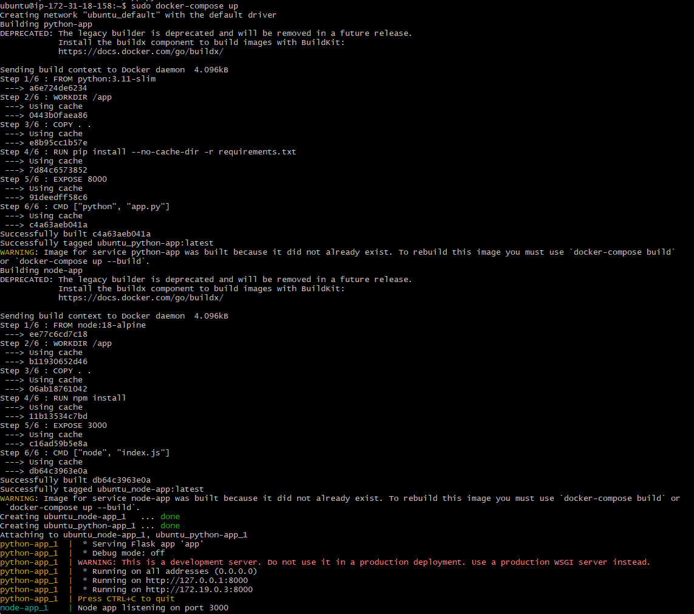

**Explanation:**

* This runs two services simultaneously: a Flask app and a Node.js app.
* Each service is built from its own directory.

**Commands:**

```bash
docker-compose up         # Start container
docker-compose down       # Stop container
docker-compose logs       # View logs
docker-compose up -d      # Run in background
```
---

## Task 1: Simple Docker Compose File

**Objective:** Create a simple Docker Compose file to serve Nginx on port 8080.

#### `docker-compose.yml`

```yaml
version: '3'
services:
  web:
    image: nginx
    ports:
      - "8080:80"
```

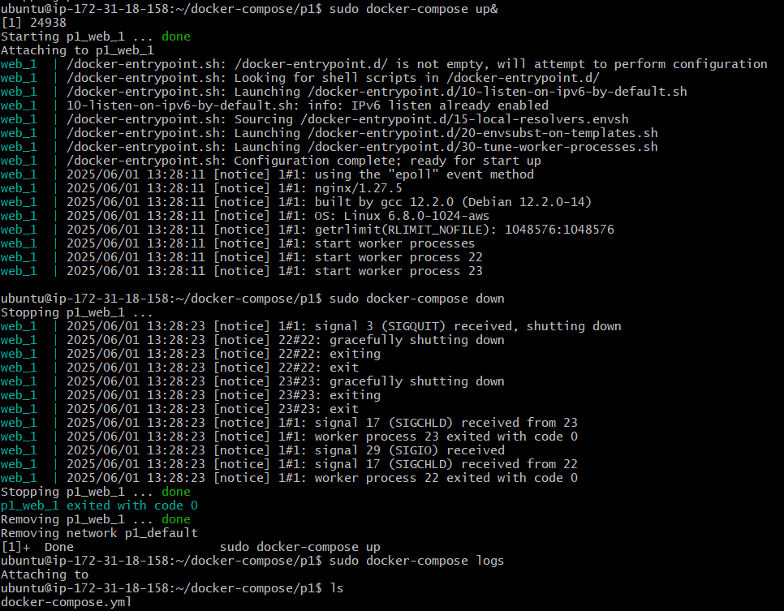
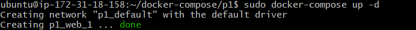

**Explanation:** Maps host port 8080 to container’s port 80 using the official `nginx` image.

---

## Task 2: Multi-Container App (Web + MySQL DB)

#### `docker-compose.yml`

```yaml
version: '3'
services:
  web:
    image: nginx
    ports:
      - "8080:80"

  db:
    image: mysql
    environment:
      MYSQL_ROOT_PASSWORD: root123
```

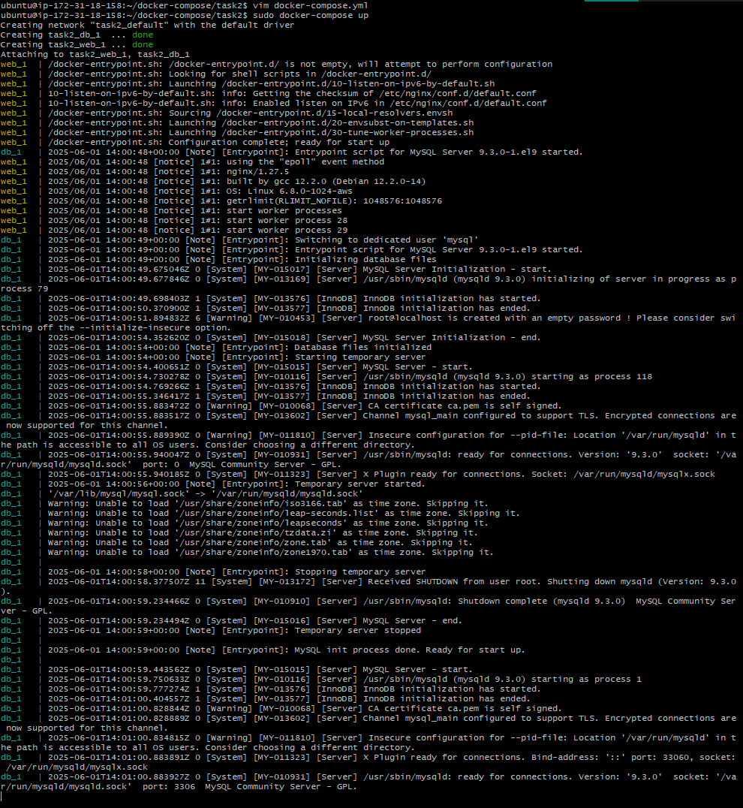

**Explanation:**

* Defines a `web` and `db` service.
* MySQL root password is set via environment variable.

---